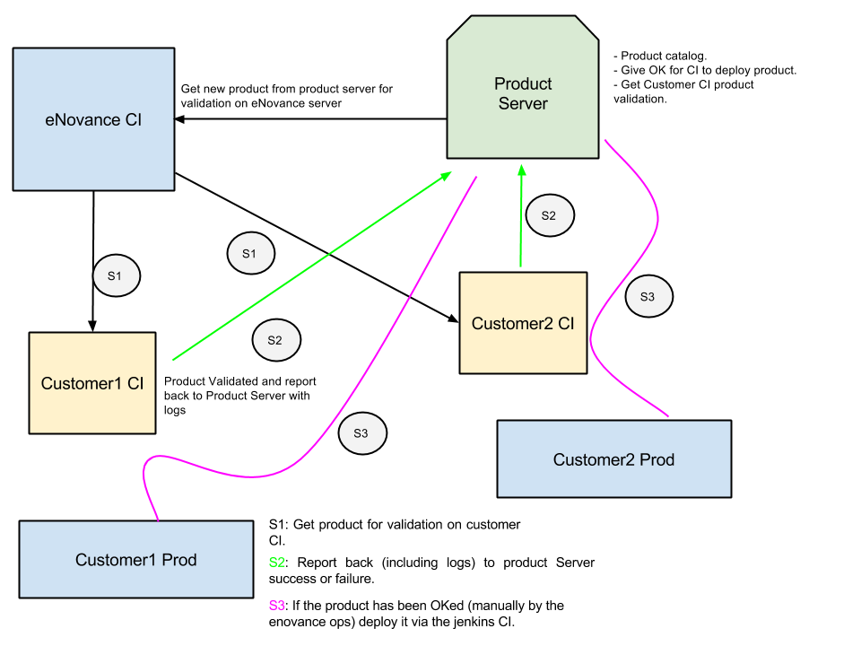

=================
Kitchen Workflow
=================

~~~~~~~~~
Glossary
~~~~~~~~~

This document describe the workflow within the kitchen with regard of
delivering product, it address some terminology definition at first
and shows the steps to devliver a product.

Products
--------

Product is what is shipped from eNovance. This usually mean :

* A marmite that describe the deployment of the product.
* The associated artifact attached to the marmite stored in a object
  store (i.e: eDeploy images, provision data, puppet/chef/ansible scripts, etc..)
* The product version.

Product can be an initial deployment or can be an update, it is up to
the product to make that distinction and handle such case.

eNovance CI
------------

The first CI in the loop, this is the CI that validate a product. It
will validate the product for the customer as a *best effort*.

When we mention *best effort* we mean within the limit of the hardware
availability.

Customer CI
------------

This is the CI for the customer, where the product get validated. This
is usually a staging environment. There can be multiple of them that
can be chained together but for the sake of clarity of this document
we are going to use only one.

Production Platform
-------------------

The final production platform where things is getting deployed.

eNovance product server
-----------------------

This is the server that validate a product, the main purpose of this
server which is located whithin the premise of eNovance is to :

* Product Catalog (TBD)
* Give the OK for a product to be deployed on the "Production Platform"
* Get the report back from all the different CI if a product has been
  validated.
* Give information to eNovance OP about product validation.

~~~~~~~~
Workflow
~~~~~~~~

The Story
----------

eNovance CI checks for new products on the product server that need to
be validated and start testing it and validate.

If it get OK the clients that are subscribed to that product will get
it for validation by a mean of a push or a pull (refresh).

The clients CI validate the product on their own testing platforms and
reports the OK or not OK status to the products server with their logs.

The sysadmin has the ability to then certify the product for
deployment if he think that's OK and set a  "ready to deploy" flag for
that product.

By the mean of refresh the clients CI would know that this product is
ready for deployment and deploy the final version into production.

Diagram
-------

